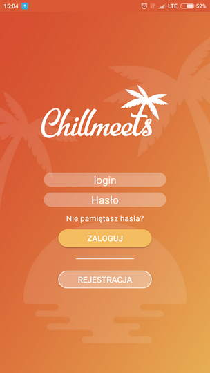
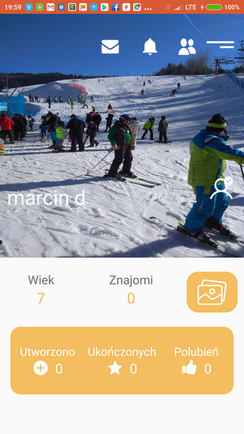
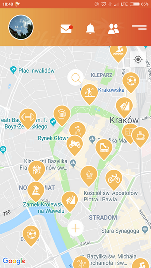

these are code samples from ChillMeets project.
Application allows to:
- sign up
- sign in

- Edit profile with name, birthday, profile-image, description
- Display profile

- Show gallery, add images, edit description of image

- add, delete friends, show list of friends

- chat function

Main feature is map that allows to:
- add marker 

- show all markers

- cluster markers
- filter markers

- click and show info about marker(activity)

- show activity details

- show list o f activities

Other features:
Notifications, inviting friends for an activity, group chat for participants of activity, User permissions for Activity: Administrators, Mods, participants, guests, token auth  and some more.

Stack:
Frontend: Android, Kotlin, Retrofit2, RxJava, picasso
Backend: At the begining php, now it's being rewrtitten in Node.js, Postgresql

What is missing: patterns like MVVM, MVP
